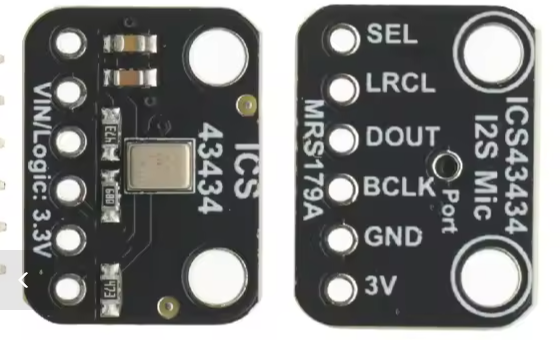

# Comunicación e inicialización y obtención de datos del sensor de ruido

## 1) Visión general

- El firmware implementa un nodo sensor (I2C slave, dirección `0x08`) que publica métricas acústicas agregadas por segundo.
- La adquisición puede hacerse desde un micrófono analógico MAX4466 (ADC, ESP32-C3) o digital ICS-43434 (I2S, XIAO ESP32-S3). El procesamiento DSP aplica ponderación A y calcula LAeq, LAFmax, L10, L90, Ld/Le/Ln y Lden.
- Ambas variantes exponen el mismo protocolo I2C y la misma estructura `SensorData`: para el master son indistinguibles (salvo la nota de unidades de §7).

## 2) Inicialización de comunicaciones (lado sensor)

### I2C (esclavo)
- Función: `I2C_Comm_Init()` en [src/I2C_Comm.cpp](../src/I2C_Comm.cpp).
- Configura pines con `Wire.setPins(I2C_SDA, I2C_SCL)` y registra los callbacks `Wire.onReceive(receiveEvent)` y `Wire.onRequest(requestEvent)` **antes** de `Wire.begin(addr)`, para que el hardware pueda atender la primera transacción.
- Pines por defecto: SDA=8/SCL=10 en el C3; SDA=5/SCL=6 (D4/D5) en el XIAO S3. Sobreescribibles por `build_flags`.
- El esclavo no fija el clock del bus (lo controla el master).

### I2S (micrófono digital)
- `MIC_I2S_Init()` en [src/MIC_I2S.cpp](../src/MIC_I2S.cpp) instala el driver I2S (24 bits en trama de 32, canal izquierdo, 16 kHz), fija pines (BCLK=2, WS=3, SD=4) y buffers DMA. La lectura es bloqueante con `i2s_read()`.

#### Cableado del módulo ICS-43434 (breakout MRS179A)



| Pin del módulo | XIAO ESP32-S3 | Función |
| :--- | :--- | :--- |
| SEL | **GND** | Selección de canal: bajo = izquierdo |
| LRCL | GPIO 3 (D2) | Word select (WS / LRCLK) |
| DOUT | GPIO 4 (D3) | Salida de datos del micrófono |
| BCLK | GPIO 2 (D1) | Reloj de bit |
| GND | GND | Masa |
| 3V | 3.3V | Alimentación (1.5-3.6 V, nunca 5 V) |

**SEL debe ir a GND.** En este breakout `SEL` es el pin `L/R` (selección de
canal) del ICS-43434, pese a que algunas descripciones de vendedor lo presenten
como selector I2S/PDM — el ICS-43434 no tiene modo PDM. Con
`I2S_CHANNEL_FMT_ONLY_LEFT` en el firmware: SEL bajo (o al aire, por el
pull-down interno) → canal izquierdo → se lee correctamente (verificado en
banco, suelo de ~34 dB); SEL a 3.3 V → canal derecho → el firmware descarta esa
media trama → **no mide nada**. Al aire funciona pero depende de un pull-down
débil: en despliegue de campo, atarlo a masa.

Otros breakouts pueden etiquetar `LRCL` como `WS`/`LRCLK`, `DOUT` como `SD` y
`SEL` como `L/R`. Si un módulo tiene `L/R` fijado a nivel alto internamente y el
nodo lee silencio, cambiar a `I2S_CHANNEL_FMT_ONLY_RIGHT` en `MIC_I2S.cpp`.

#### Conexión I2C con el master (nodo I2S)

SDA = GPIO 5 (D4), SCL = GPIO 6 (D5), dirección `0x08`. SDA-SDA, SCL-SCL y
**masa común entre ambas placas**, imprescindible aunque cada una tenga su
propia alimentación. La mayoría de placas ESP32 ya llevan pull-ups; solo si el
bus falla o se cuelga, añadir 4.7 kΩ de SDA y SCL a 3.3 V en un único punto del
bus. Para latiguillos de más de 20-30 cm, bajar el clock del master a 100 kHz.
Pines sobreescribibles con `-D I2C_SDA=x -D I2C_SCL=y`; evitar GPIO 43/44 (UART
del USB) y dejar libres GPIO 2/3/4 para el micrófono.

#### Avisos de compilación (core Arduino 3.x / IDF 5.x)

El driver `driver/i2s.h` está marcado como obsoleto en IDF 5.x, y los campos
`dma_buf_count`/`dma_buf_len` son alias de `dma_desc_num`/`dma_frame_num`. Son
avisos, no errores: el binario funciona correctamente. Para silenciarlos,
añadir al entorno S3 en `platformio.ini`:

```ini
build_flags =
    -D I2S_SUPPRESS_DEPRECATE_WARN=1
    -Wno-deprecated-declarations
```

La migración a la API nueva (`driver/i2s_std.h`) queda pendiente; ataría el
proyecto a core 3.x, mientras que la API legacy mantiene compatibilidad con
cores 2.x.

### ADC (micrófono analógico)
- En [src/main.cpp](../src/main.cpp) se configura el ADC con `adc1_config_channel_atten()` y `esp_adc_cal_characterize()`, y se deriva una pendiente `adc_mv_per_count` (solo pendiente, sin offset) para convertir amplitudes AC en float.

## 3) Flujo de obtención de datos (lado sensor)

- **Muestreo**: `sampling_task()` — polling wrap-safe a 16 kHz con `adc1_get_raw()` en el nodo ADC; bloqueo en `MIC_I2S_Read()` (DMA) en el nodo I2S.
- **DSP**: cascada de 3 biquads de ponderación A ([src/DSP_Engine.cpp](../src/DSP_Engine.cpp)), RMS ponderado A, máximos con EMA rápida (125 ms), percentiles L10/L90 sobre bloques completos de 20 s, y acumulación por periodos (Ld 7-19 h, Le 19-23 h, Ln 23-7 h) con Lden cuando hay hora válida.
- **Agregación y entrega**: cada segundo se construye un `SensorData` y se publica vía cola (`xQueueOverwrite(dataQueue, ...)`). `I2C_Comm_Sync()` vacía la cola y copia a `cachedSensorData` bajo sección crítica (`portENTER_CRITICAL_SAFE`), marcando `data_ready`. `requestEvent()` sirve un snapshot atómico de la caché.

## 4) Protocolo y comandos

Definidos en [src/I2C_Comm.h](../src/I2C_Comm.h):

| Comando | Código | Respuesta |
| :--- | :--- | :--- |
| `CMD_GET_STATUS` | 0x20 | 1 byte: 1 = OK, 0 = no publicar (ver §6) |
| `CMD_GET_DATA` | 0x01 | `SensorData` completo empaquetado |
| `CMD_IDENTIFY` | — | Identificación del nodo |
| `CMD_LEGACY_*` | — | Lecturas puntuales simples (compatibilidad) |

**Contrato del byte de estado.** Status 0 significa "no publiques este dato", sea cual sea la causa:
- Arranque: aún no ha aterrizado la primera agregación (`data_ready == 0`).
- Fallo de micrófono: bias fuera de rango (nodo ADC) o silencio absoluto bajo el suelo del micro (nodo I2S).
- Segundo inválido: RMS por debajo del umbral mínimo.
- **Muestreo detenido** (desde v3.1.2): si el agregador no recibe ningún segundo completo en 2 s, baja el status a 0, congela `cycles` y emite `[WARN] No samples for 2 s` por Serial. Un nodo colgado se ve como fallo, nunca como dato plano creíble.

En segundos inválidos el esclavo conserva los últimos valores válidos en la estructura (nunca publica ceros); la señal de invalidez es exclusivamente el status.

## 5) Lado master: flujo recomendado

Ejemplo de referencia: [examples/i2c_master/src/main.cpp](../examples/i2c_master/src/main.cpp).

1. Inicializar I2C: `Wire.begin(SDA, SCL)` y `Wire.setTimeOut(100)`.
2. Enviar `CMD_GET_STATUS` (`beginTransmission` + `write` + `endTransmission`), leer 1 byte con `requestFrom`.
3. Si status == 1, enviar `CMD_GET_DATA` y leer `sizeof(SensorData)` bytes en una estructura del mismo layout.
4. **Validación triple antes de publicar** (las tres condiciones, no basta una):
   - Lectura completa: se recibieron exactamente `sizeof(SensorData)` bytes. Atención: con el esclavo I2C de arduino-esp32, si el esclavo entrega menos bytes el hardware puede rellenar con padding y `requestFrom` devolver la longitud completa igualmente — por eso esta condición sola no es suficiente.
   - Status == 1.
   - **`cycles` mayor que el de la lectura anterior**: detecta un esclavo que responde correctamente pero con datos congelados (struct válido y rancio). Sin esta condición, un nodo colgado pasa los otros dos filtros y el dashboard pinta líneas planas.
5. Si cualquier condición falla: descartar la muestra (no publicar el buffer anterior) y reintentar en el siguiente ciclo.

## 6) Sincronización y seguridad de datos

- Cola FreeRTOS de tamaño 1 (`xQueueOverwrite`) entre agregador y capa I2C: el master siempre lee lo último.
- Spinlock (`portMUX` / `portENTER_CRITICAL_SAFE`) alrededor de la caché compartida: `requestEvent` sirve un snapshot atómico, eliminando lecturas rasgadas (torn reads) si la petición llega en mitad de una actualización.
- `data_ready` impide servir status OK con la estructura a ceros del arranque.

## 7) Semántica de los datos publicados

- **`noiseAvgDb` es el LAeq del último segundo**, no el promedio del intervalo entre lecturas del master. Un master que lee cada 60 s está muestreando 1 segundo de cada 60: válido como indicador de tendencia, pero no es el LAeq,60s. Si se necesita el promedio del intervalo, debe acumularse en el esclavo (cambio de protocolo pendiente de diseño).
- `noiseAvgLegalDb` (L10) y `lowNoiseLevel` (L90) se recalculan cada bloque completo de 20 s y se mantienen entre bloques.
- Ld/Le/Ln solo se actualizan dentro de su franja horaria; fuera de ella conservan el último valor del periodo. Lden requiere hora válida en el nodo.
- **Unidades del campo legacy de mV en el nodo I2S**: `noise`, `noiseAvg`, `noisePeak`, etc. llevan µFS (micro-fracciones de fondo de escala) en lugar de milivoltios, porque un micrófono digital no tiene tensión analógica. Los campos en dB tienen semántica idéntica en ambas variantes y son la salida primaria.
- `cycles` se incrementa una vez por segundo agregado (válido o no) y se congela si el muestreo se detiene: es el latido del nodo.

## 8) Puntos importantes para integradores

- Respetar timeouts I2C (`Wire.setTimeOut`) y no bloquear ante fallos de bus.
- No publicar jamás con status 0, y registrar (log o campo extra) status y `cycles` en cada lectura: son el diagnóstico diferencial entre "nodo colgado" y "pipeline de publicación defectuoso".
- Tras actualizar de versiones ≤3.1.0 a ≥3.1.1, **recalibrar** `CALIBRATION_RMS_MV` en el nodo ADC (la escala de mV cambió al eliminar el offset de la conversión). Ver `examples/calibration/`.

## Referencias de implementación

- Protocolo I2C: [src/I2C_Comm.cpp](../src/I2C_Comm.cpp), [src/I2C_Comm.h](../src/I2C_Comm.h)
- Nodo ADC (C3 + MAX4466): [src/main.cpp](../src/main.cpp)
- Nodo I2S (S3 + ICS-43434): [src/main_i2s.cpp](../src/main_i2s.cpp), [src/MIC_I2S.cpp](../src/MIC_I2S.cpp)
- DSP: [src/DSP_Engine.cpp](../src/DSP_Engine.cpp)
- Master de ejemplo: [examples/i2c_master/src/main.cpp](../examples/i2c_master/src/main.cpp)
- Calibración: [examples/calibration/](../examples/calibration/) (ADC), [examples/calibration_i2s/](../examples/calibration_i2s/) (I2S)
