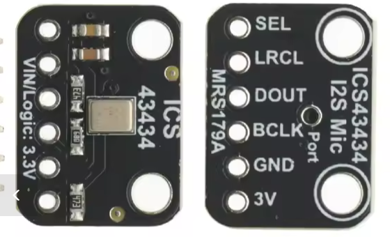

# Verificación del nodo I2S (XIAO ESP32-S3 + ICS-43434)

Firmware autónomo que ejecuta solo la cadena de medida (I2S + ponderación A + RMS)
y muestra por Serial el LAeq (dB) y el nivel RMS (dBFS) cada segundo. No usa I2C.

## Cableado



Etiquetas según la serigrafía del breakout MRS179A (foto). Otros módulos usan
`WS`/`LRCLK` por `LRCL`, `SD` por `DOUT` y `L/R` por `SEL`.

| Pin del módulo | XIAO ESP32-S3 |
| :--- | :--- |
| SEL | **GND** |
| LRCL | GPIO 3 (D2) |
| DOUT | GPIO 4 (D3) |
| BCLK | GPIO 2 (D1) |
| GND | GND |
| 3V | 3.3V |

**SEL a GND**: es el pin `L/R` del ICS-43434 (no un selector I2S/PDM: el chip no
tiene modo PDM). Con `I2S_CHANNEL_FMT_ONLY_LEFT`, SEL a 3.3 V deja el nodo sin
medir. Al aire funciona por el pull-down interno, pero en campo debe ir a masa.

## Uso

1. Compilar y flashear: entorno `seeed_xiao_esp32s3`.
2. Abrir Monitor Serie a 115200 baud.
3. Acoplar un calibrador de **94,0 dB / 1 kHz** al puerto del micrófono y
   dejar que la lectura se estabilice unos segundos.
4. Copiar el valor de `MIC_OFFSET_DB` que imprime la propia línea al
   `build_flags` del firmware principal. **No lo calcules a mano como
   `94 − LAeq`**: eso solo vale si este sketch y el firmware comparten la
   misma conversión, que es justo lo que el valor impreso ya tiene en cuenta.
5. Contrastar en **campo libre** contra un sonómetro de referencia. Un
   calibrador diseñado para cápsula de 1/2" acoplado a un puerto MEMS en una
   cavidad pequeña entrega más SPL que el nominal, así que el paso 4 por sí
   solo puede sobrecorregir.

**Este sketch replica la conversión del firmware exactamente**: mismo sample
rate (48 kHz), mismos coeficientes de ponderación A y mismo término
pico→RMS (+3,0103 dB). Si alguna vez divergen, el trim que salga de aquí
estará equivocado en esa diferencia. Versiones anteriores de este ejemplo
fallaban en las tres cosas a la vez —16 kHz frente a los 48 kHz del nodo, los
coeficientes A antiguos y sin el término pico→RMS—, y así un 106,5 dB medido
se convertía en un trim 3 dB desviado.

No aplica ningún trim propio, a propósito: su trabajo es mostrar el nivel sin
corregir para poder derivarlo.

**Las dos cifras de RMS.** `dBFS(A)` es lo que publica la línea de log del
firmware; `dBFS(Z)` es sin ponderar e incluye el retumbe de baja frecuencia que
la ponderación A quita, así que en una sala real sale más alto. Para comparar
contra el firmware, usa `dBFS(A)`.

## Resultado esperado

Este sketch imprime el nivel **sin corregir**, así que sus LAeq salen más altos
que los del firmware en la misma sala: la diferencia es exactamente el
`MIC_OFFSET_DB` que acabes poniendo. Una línea por segundo:

```
LAeq: 54.70 dB | dBFS(A): -68.31 | dBFS(Z): -59.40 | if calibrator: MIC_OFFSET_DB=39.30
LAeq: 108.28 dB | dBFS(A): -14.73 | dBFS(Z): -13.46 | if calibrator: MIC_OFFSET_DB=-14.28
```

La primera línea es una sala tranquila (unos 41 dB reales una vez aplicado el
trim); la segunda, con el calibrador de 94,0 dB acoplado. **La columna
`MIC_OFFSET_DB` solo significa algo en la segunda situación** — con el
calibrador puesto. En ambiente da un número sin sentido, porque el sketch no
sabe a qué nivel estás realmente.

Nota sobre las unidades: estas unidades leen muy por encima de lo que implica
su hoja de datos. Un ICS-43434 que cumpliera los −26 dBFS daría
`dBFS(A) ≈ -29` con el calibrador y un `MIC_OFFSET_DB` cercano a 0; las
medidas reales dan unos 14 dB más de nivel. Mide antes de dar por bueno
cualquier valor, incluido el que trae el firmware.

## Diagnóstico

| Síntoma | Causa probable |
| :--- | :--- |
| `[WARN] Silencio absoluto` | SEL a 3.3 V, o línea DOUT sin conectar |
| Silencio con SEL a GND | Módulo con `L/R` fijado en alto: usar `I2S_CHANNEL_FMT_ONLY_RIGHT` |
| `[WARN] Clipping detected` con `clip:` alto | Nivel > ~120 dB SPL o interferencia; el segundo se invalida (integridad) |
| Lecturas erráticas | Cables largos (>10 cm) en BCLK/DOUT, o masa mal referenciada |
| Avisos de compilación sobre API obsoleta | Normal en core 3.x; ver `platformio.ini` (flags de supresión) |

---

## English version

# Verification of the I2S node (XIAO ESP32-S3 + ICS-43434)

Standalone firmware that runs only the measurement chain (I2S + A-weighting + RMS) and prints LAeq (dB) and RMS (dBFS) every second over Serial. It does not use I2C.

## Wiring


Labels follow the silkscreen of the MRS179A breakout (photo). Other modules use `WS`/`LRCLK` instead of `LRCL`, `SD` instead of `DOUT`, and `L/R` instead of `SEL`.

| Module pin | XIAO ESP32-S3 |
| :--- | :--- |
| SEL | **GND** |
| LRCL | GPIO 3 (D2) |
| DOUT | GPIO 4 (D3) |
| BCLK | GPIO 2 (D1) |
| GND | GND |
| 3V | 3.3V |

**SEL to GND**: this is the `L/R` pin of the ICS-43434 (not an I2S/PDM selector; the chip has no PDM mode). With `I2S_CHANNEL_FMT_ONLY_LEFT`, a 3.3 V SEL leaves the node silent. It may work floating due to the internal pull-down, but in the field it should be tied to ground.

## Usage

1. Compile and flash: `seeed_xiao_esp32s3` environment.
2. Open the Serial Monitor at 115200 baud.
3. Couple a **94.0 dB / 1 kHz** calibrator to the microphone port and let the reading settle for a few seconds.
4. Copy the `MIC_OFFSET_DB` value the line itself prints into the main firmware's `build_flags`. **Do not compute it by hand as `94 - LAeq`**: that only holds if this sketch and the firmware share the same conversion, which is exactly what the printed value already accounts for.
5. Verify in **free field** against a reference sound level meter. A calibrator designed for a 1/2" capsule, coupled to a MEMS port in a small cavity, delivers more SPL than nominal, so step 4 alone can over-correct.

**This sketch mirrors the firmware's conversion exactly**: same sample rate (48 kHz), same A-weighting coefficients, same peak-to-RMS term (+3.0103 dB). If the two ever diverge, the trim derived here is wrong by the difference. Earlier versions of this example got all three wrong at once — 16 kHz against the node's 48 kHz, the superseded A coefficients, and no peak-to-RMS term — which is how a measured 106.5 dB turned into a trim 3 dB off.

It applies no trim of its own, by design: its job is to show the untrimmed level so the trim can be derived from it.

**The two RMS figures.** `dBFS(A)` is what the firmware's log line reports; `dBFS(Z)` is unweighted and includes low-frequency rumble that A-weighting removes, so it reads higher in a real room. Use `dBFS(A)` when comparing against the firmware.

## Expected result

This sketch prints the **untrimmed** level, so its LAeq reads higher than the firmware's in the same room — the difference is exactly the `MIC_OFFSET_DB` you end up setting. One line per second:

```text
LAeq: 54.70 dB | dBFS(A): -68.31 | dBFS(Z): -59.40 | if calibrator: MIC_OFFSET_DB=39.30
LAeq: 108.28 dB | dBFS(A): -14.73 | dBFS(Z): -13.46 | if calibrator: MIC_OFFSET_DB=-14.28
```

The first line is a quiet room (about 41 dB once the trim is applied); the second has a 94.0 dB calibrator coupled. **The `MIC_OFFSET_DB` column only means anything in the second case** — with the calibrator on. In ambient it prints a meaningless number, because the sketch has no idea what level you are actually in.

A note on the parts: these units read far above what their datasheet implies. An ICS-43434 meeting its −26 dBFS spec would give `dBFS(A) ≈ -29` with the calibrator and a `MIC_OFFSET_DB` near 0; real measurements come out about 14 dB hotter. Measure before trusting any value, including the one the firmware ships with.

## Diagnosis

| Symptom | Likely cause |
| :--- | :--- |
| `[WARN] Silent` | SEL at 3.3 V or DOUT line disconnected |
| Silence with SEL at GND | Module with `L/R` hardwired high: use `I2S_CHANNEL_FMT_ONLY_RIGHT` |
| `[WARN] Clipping detected` with high `clip:` | Level > ~120 dB SPL or interference; the second is invalidated |
| Erratic readings | Long cables (>10 cm) on BCLK/DOUT, or poor ground reference |
| Compilation warnings about deprecated API | Normal on core 3.x; check `platformio.ini` suppression flags |